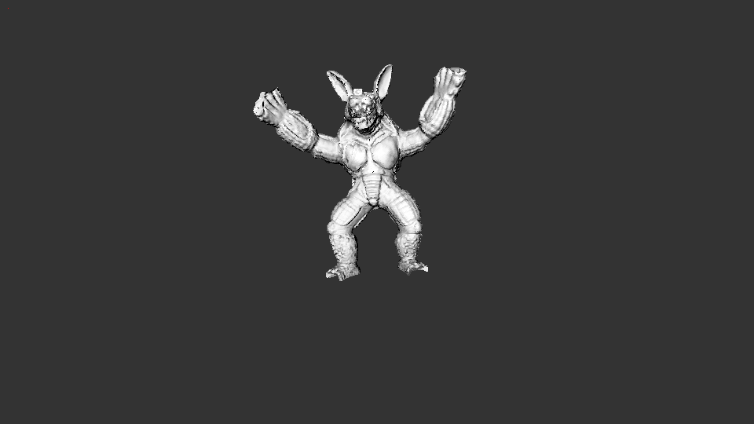

# Render-Farm



This Tool Is A Rendering Engine Who's Output Is A Video Clip. This Tool Is A Simplistic Attempt At Recreating The Software Used In 3D Animated Movies.

## Requirements

C++, Python, and the cv2 python package.

## How To Install

[Install Python](https://www.python.org/downloads/)

```
git clone https://github.com/PolarToCartesian/Render-Farm
cd Render-Farm/setup/
python install_python_dependencies_pip.py
```

You can delete :

+ Readme.md
+ images/
+ models/
+ .gitignore

You Should Modify :

+ Source.cpp

## Compiling On Linux

```
cd Render-Farm/setup/
python linux_compile.py
```

Note: G++ Warnings Are Disabled.

The executable will be located in the main Render-Farm/ directory.

## Thanks To

+ [Barycentric Interpolation](https://codeplea.com/triangular-interpolation)
+ [Surface Normal Calculation](https://www.khronos.org/opengl/wiki/Calculating_a_Surface_Normal)
+ [General 3D Matrix Calculations](https://www.youtube.com/playlist?list=PLRIWtICgwaX0u7Rf9zkZhLoLuZVfUksDP)
+ [2D Triangle Renderer](https://github.com/ssloy/tinyrenderer/wiki/Lesson-2:-Triangle-rasterization-and-back-face-culling)
+ [Ray Marcing](http://jamie-wong.com/2016/07/15/ray-marching-signed-distance-functions/#signed-distance-functions)

## Task List

+ [x] Seperate Color Class
+ [x] Create An Image Renderer
+ [x] Static Member Functions In Classes
+ [x] Fixing The First Image Being Black Bug
+ [x] Use Clearer Types
+ [x] Remove Passing Simple Values By Reference
+ [x] Camera Rotation
+ [X] Read Obj Files Who Have 4 Component Faces
+ [ ] 2D Text Rendering
+ [ ] Ray Marching
+ [ ] PNG or JPEG instead of PPM*

*Low priority

## Test Model Credit

+ [town.txt](https://free3d.com/3d-model/environment-23742.html)
+ [quad.txt](https://github.com/triplepointfive/ogldev/blob/master/Content/quad.obj)
+ [teapot.txt](https://graphics.stanford.edu/courses/cs148-10-summer/as3/code/as3/teapot.obj)
+ [armadillo.txt](http://www.prinmath.com/csci5229/OBJ/index.html)